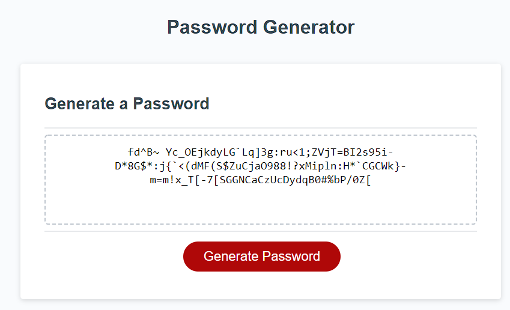

# Password Generator Starter Code

## Link to the deployed application
https://kbjss071.github.io/PasswordGenerator/

 

## To-do lists
- When the button to generate a password is clicked, a series of prompts for password criteria should be presented.
- When prompted for password criteria, I select which criteria to include in the password.
- When prompted for the length of the password, I choose a length of at least 8 characters and no more than 128 characters.
- When asked for character types to include in the password, I confirm whether or not to include lowercase, uppercase, numeric, and/or special characters.
- When I answer each prompt, then my input should be validated and at least one character type should be selected.
- When all prompts are answered, then a password is generated that matches the selected criteria.
- When the password is generated, the password is either displayed in an alert or written to the page.

 

## Works done for this project
- Assigned lowercase, uppercase, numeric and special characters to individual variables.
- Initialized variables to store password length and characters that will be randomly generated.
- Defined the `generatePassword()` function which is called from the function `writePassword()`. The `generatePassword()` function will perform the followings:
    - Prompt user to enter a number between 8 and 128 to set the length of new password. If the user enters an unallowed number, it will alert the user and ask the user to enter a new number.
    - Prompt user to determine which character types user wants to include in their password. If no character type is selected, the password will include only uppercase character.
    - Return a randomly generated password to assign the password to a variable where the `generatePassword()` is called.